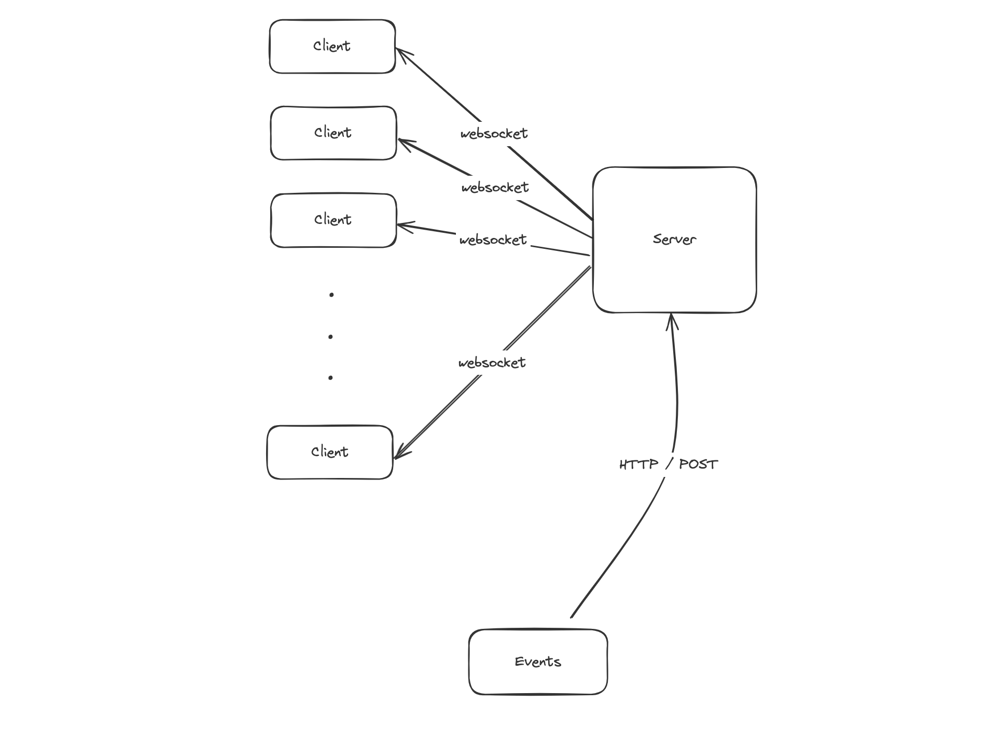

# Valkyrie
Valkyrie: A Distributed, Realtime Event Streaming Framework

[](https://github.com/ahmed-zubair-1998/valkyrie/actions/workflows/test-coverage.yml)
[](https://raw.githubusercontent.com/ahmed-zubair-1998/valkyrie/badges/.badges/main/coverage.svg)
[](https://goreportcard.com/report/github.com/ahmed-zubair-1998/valkyrie)

## Architecture


## Setup
Start the server with the following command:

```bash
go run .
```

## Load Testing
[Locust](https://locust.io) is used for load testing. To run load test you need to install dependecies using:

```bash
pip install locust websocket-client
```

Setup the client load using:

```bash
cd load-tests/clients
locust -P 8088
```

Go to http://localhost:8088 to start creating test clients

Setup the events load using:

```bash
cd load-tests/events
locust
```

Go to http://localhost:8089 to start generating test events
